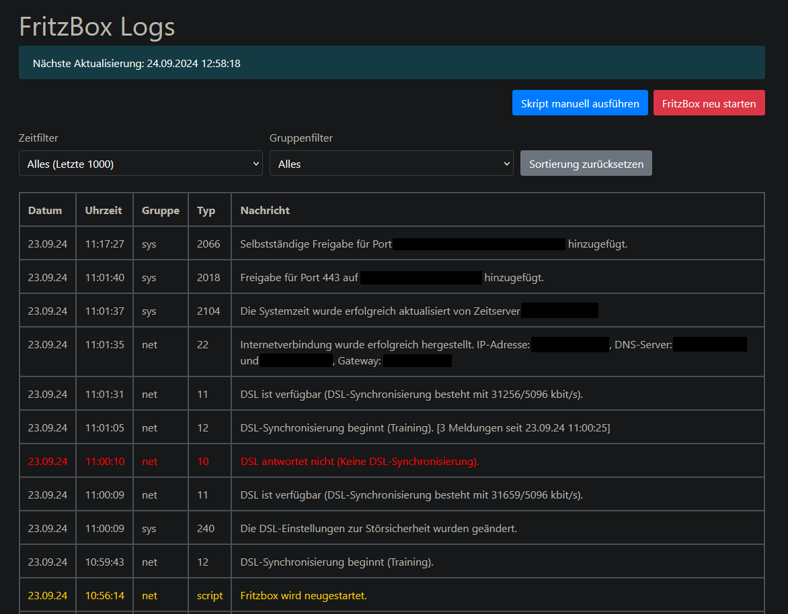

# Fritzbox-Log-Webview | Automatic Syslog Backup

This Project was made because AVM doenst implement a Backup Solution for theyre Syslogs.
And incase you have restarted your Router (Fritzbox) or a Power Outage happens, the entire Syslog gets wiped..

For that case you have run this Docker Solution which automatically connect each hour to your Router and collect new Log entries.
Duplicate entries will be ignored.

And theres a useful reboot button.



### How to Run

Ive developed this Tool to run on my Synology NAS, but you can run it at any Docker Server.
Just adjust the docker-compose.yml paths.

You can decide if you want to backup the entire Syslog or ignore some unimportant Logs like these:
```bash
500   # weblogin - success
501   # weblogin - wrong password
503   # weblogin - invalid session
504   # user login - success
505   # user login - wrong password
506   # tr64 login - success
3420  # wireguard connection - success
3421  # wireguard connection - closed
```

1. Create a User with tr64 permissions on your fritzbox router if not done yet.
2. Make sure you have created your directory where you want to save your persistent database !
    In that Case '/volume1/docker/fritzbox-log-webview'
3. Run docker compose

```bash
version: "3.3"
services:
  fritzbox-log-webview:
    container_name: fritzbox-log-webview
    environment:
      - USER=your-tr64-user
      - PASSWORD=your-password
      - URL=http://192.168.178.1
      - IGNORE_LOG_ID=500,501,503,504,505,506,3420,3421
    ports:
      - 5588:5588
    volumes:
      - /volume1/docker/fritzbox-log-webview:/app/data
    network_mode: bridge
    restart: always
    image: protekdev/fritzbox-log-webview:latest
```

**NOTE:** The container is set to automatically restart when the docker daemon restarts.

### Known Issues

The network_mode must be bridge otherwise the LXC Container ist not able to connect to your Router !
